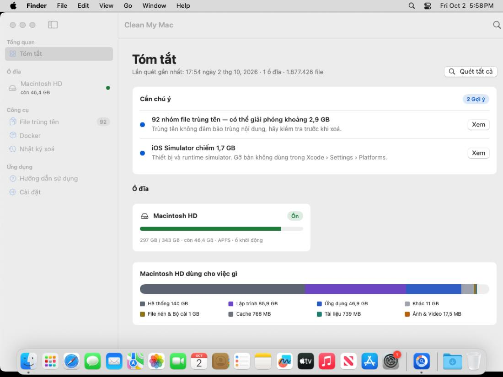
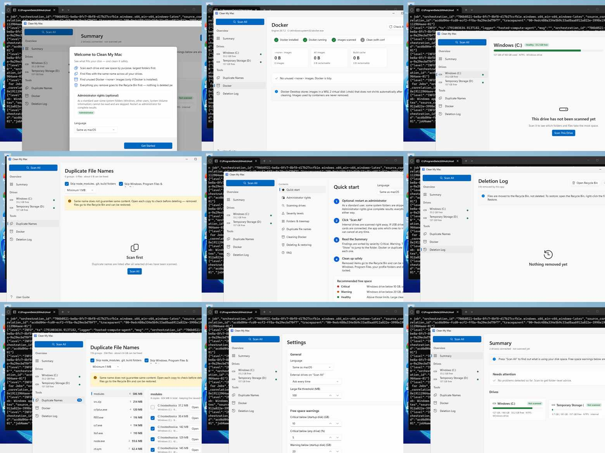

# Thiết kế giao diện

Mẫu thiết kế tương tác (6 màn hình, vẽ theo phong cách macOS; chỉ xem được khi chủ sở hữu chia sẻ):
**https://claude.ai/artifact/SrnoYTUQTpu9VbmCPEiELa**

Cả hai bản (macOS và Windows) dựng theo **cùng bố cục, cùng bảng màu, cùng câu chữ**, nhưng dùng bộ điều khiển gốc của từng hệ điều hành.

Ảnh chụp app thật do CI tự chạy và chụp lại:





## Nguyên tắc

- **Giao diện gốc của từng nền tảng**: macOS dùng SwiftUI (`NavigationSplitView`, font hệ thống, Light/Dark mode tự động); Windows dùng WinUI 3 (`NavigationView`, giao diện Fluent, hiệu ứng Mica khi hệ thống hỗ trợ).
- **Chia theo ổ đĩa**: menu bên trái liệt kê từng ổ (ổ khởi động, ổ trong khác, ổ rời) với chấm màu tình trạng. Ổ rời tự hiện khi cắm, tự ẩn khi rút.
- **Menu luôn hiện trên mọi trang**: dù trang chưa có dữ liệu, đang lỗi hay cửa sổ nhỏ. Xem cơ chế ở mục "Giữ menu và chống tràn viền".
- **Mức độ bằng màu + chữ**: Nghiêm trọng (đỏ), Cảnh báo (cam), Gợi ý (xanh dương), Ổn (xanh lá). Màu luôn đi kèm nhãn chữ để người mù màu vẫn đọc được.
- **Lớn trước, nhỏ sau**: mọi danh sách mặc định sắp xếp dung lượng giảm dần.
- **An toàn trước**: mọi thao tác xoá có hộp thoại xác nhận và đi vào Thùng rác; vị trí hệ thống bị khoá. Riêng Windows, ổ không có Thùng rác (USB, thẻ nhớ) có cảnh báo đỏ và nút ghi rõ "Xoá vĩnh viễn".
- **Chống tràn viền**: trang không bao giờ vẽ ra ngoài cửa sổ; quá hẹp thì cuộn.

## Các màn hình

| # | Màn hình | Nội dung chính |
|---|---|---|
| 1 | **Tóm tắt** | Danh sách "Cần chú ý" theo mức độ, thẻ từng ổ đĩa, thanh "dùng cho việc gì" của ổ khởi động |
| 2 | **Chi tiết ổ đĩa** | Thanh dung lượng theo phân loại; 3 tab: Phân loại · Thư mục (treemap + danh sách) · File lớn |
| 3 | **File trùng tên** | Cột nhóm (xếp theo dung lượng giải phóng được) + chi tiết từng bản, đánh dấu bản mới nhất |
| 4 | **Docker** | Thanh 4 bước (cài đặt → đang chạy → quét → dọn), ô thống kê, danh sách image `<none>` |
| 5 | **Xác nhận ổ rời và tiến trình quét** | Hộp thoại chọn ổ rời, thẻ tiến trình (số file, dung lượng, thời gian, huỷ) |
| 6 | **Hướng dẫn sử dụng** | Mục lục bên trái, nội dung bên phải, đổi ngôn ngữ ngay tại chỗ |

Ngoài ra: Nhật ký xoá, Cài đặt, màn hình chào lần đầu, hộp thoại xác nhận chuyển vào Thùng rác / xoá image Docker.

```
┌──────────────────┬────────────────────────────────────────────────┐
│ TỔNG QUAN        │  Macintosh HD     [Phân loại|Thư mục|File lớn]  │
│  Tóm tắt         │  ████████████████████░░  242 / 256 GB   [Quét]  │
│ Ổ ĐĨA            ├────────────────────────────────────────────────┤
│  Macintosh HD  🟠│  ┌── Treemap ──────────┐  ┌── Danh sách ↓ ─────┐│
│  Samsung T7    🟢│  │                     │  │ Library    82.1 GB ││
│ CÔNG CỤ          │  │                     │  │ Developer  40.3 GB ││
│  File trùng tên  │  └─────────────────────┘  │ Movies     22.7 GB ││
│  Docker          │                           └────────────────────┘│
│  Nhật ký xoá     │                                                  │
│ Hướng dẫn · Cài đặt                                                 │
└──────────────────┴────────────────────────────────────────────────┘
```

## macOS và Windows: cùng ý, khác điều khiển

| Thành phần | 🍎 macOS (SwiftUI) | 🪟 Windows (WinUI 3) |
|---|---|---|
| Điều hướng | `NavigationSplitView` + `List` kiểu sidebar | `NavigationView` (ngăn trái luôn mở), mục cuối: Hướng dẫn, Cài đặt |
| Nút Quét tất cả | Thanh công cụ góc phải + menu File (⌘R) | Nút nổi bật ở đầu ngăn menu |
| Nền | Chất liệu hệ thống | Mica (nếu hỗ trợ) |
| Biểu tượng | SF Symbols | Segoe Fluent Icons |
| Chuyển tab ổ đĩa | `Picker` kiểu phân đoạn | `SelectorBar` |
| Hộp thoại | Sheet, alert | `ContentDialog` (một hộp thoại tại một thời điểm) |
| Đường dẫn thư mục | Thanh đường dẫn tự dựng | `BreadcrumbBar` |
| Treemap | View SwiftUI trong `ZStack` | `Canvas` + `Border` |
| Thao tác trên file | Chuột phải + thanh nút dưới danh sách | Thanh nút dưới danh sách (chưa có chuột phải) |
| Xem file | Quick Look | Mở bằng ứng dụng mặc định |
| Chống tràn viền | `PageContainer` | `PageHost` (ScrollViewer + kích thước tối thiểu từng trang) |

### Giữ menu và chống tràn viền
- 🍎 `columnVisibility` của `NavigationSplitView` được khoá ở `.all` và tự khôi phục nếu hệ điều hành thu gọn; nút ẩn menu bị gỡ (macOS 14+); chiều rộng cột menu đặt ở modifier ngoài cùng. Mục lục của trang Hướng dẫn dùng danh sách thường (không dùng kiểu sidebar) để không tranh chấp với menu chính.
- 🪟 Ngăn trái của `NavigationView` luôn mở; sự kiện đóng ngăn bị huỷ; nút thu gọn bị ẩn. Lỗi khi dựng một trang chỉ hiện bảng lỗi trong vùng nội dung; `UnhandledException` toàn app được chặn để app không thoát.
- Cả hai: mỗi trang có kích thước tối thiểu (khoảng 560–720 px chiều ngang tuỳ trang). Cửa sổ nhỏ hơn thì cuộn; phần vẫn rộng hơn thì bị cắt gọn, không vẽ ra ngoài. Thanh nút và bộ lọc tự xuống dòng thay vì bị cắt chữ khi hẹp.
- 🪟 Cửa sổ khi mở không bao giờ lớn hơn vùng làm việc của màn hình.

## Bảng màu

Hai bản dùng **cùng giá trị màu** (`Theme.swift` cho macOS, `UI/Ui.cs` cho Windows).

| Vai trò | Màu |
|---|---|
| Nhấn (accent) | `#0A5CD4` |
| Nghiêm trọng | `#C4261C` |
| Cảnh báo | `#C25400` |
| Gợi ý | `#0A5CD4` |
| Ổn | `#1F7A3B` |
| Ứng dụng / Lập trình / Ảnh & Video / Tài liệu / Cache | `#2F5FC4` / `#6B45C2` / `#B8620F` / `#1F7F70` / `#6C717A` |

## Biểu tượng ứng dụng

Hình biểu đồ tròn dung lượng trên nền xanh, có kính lúp ở giữa. Sinh bằng `scripts/generate_icon.py` (macOS dùng bộ `AppIcon.appiconset`; Windows dùng `AppIcon.ico` tạo từ cùng ảnh `docs/icon.png`).
